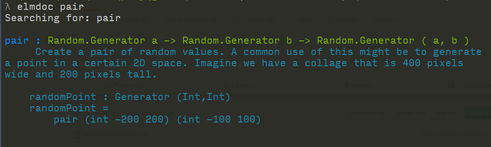

# elmdoc

So you want to do some [Elm](http://elm-lang.org/) but you're on the train, or
without Internet somehow. How do you read all the docs for the packages you're
using? Elmdoc. That's how.

## Installation

(This will no doubt be easier when this is released properly, but for now...)

1. Get you a [Rust installed](https://rustup.rs/)
1. Ensure `$HOME/.cargo/bin` is on your `$PATH`
1. `cargo install elmdoc` -- now you have an `elmdoc`

## Usage

1. Open a terminal in your Elm project (this will only work if you have downloaded packages with elm-package - i.e. there is a directory called `elm-stuff` in your project)
2. `elmdoc pair` -- This should print out the docs for the `Random.pair` function
